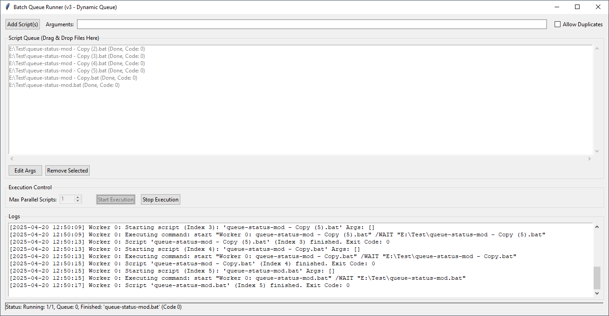
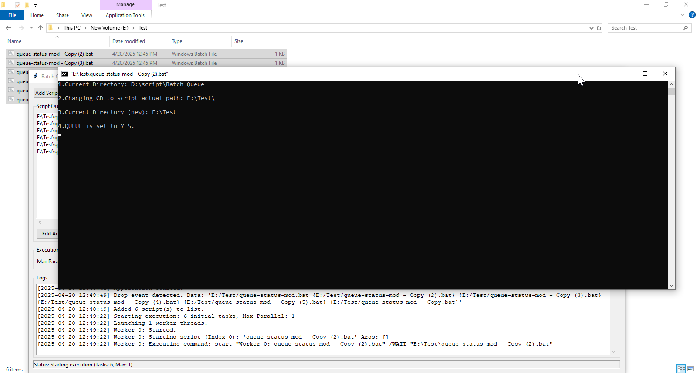
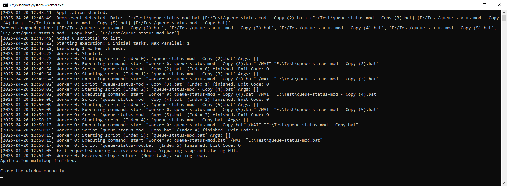

# Batch Queue Runner GUI
A Python-based GUI application for managing and executing batches of scripts (.bat, .py, .sh, .exe, etc.) with controlled parallelism and dynamic queue management.

[](https://opensource.org/licenses/MIT) 

## Description

This tool provides a user-friendly graphical interface to run multiple scripts concurrently. Users can add scripts via a file dialog or drag-and-drop, specify custom arguments, control the maximum number of parallel executions, and monitor progress through logs. A key feature is the ability to add new scripts to the queue even while execution is active, making it **suitable for dynamic or long-running workflows.**

**It helps solve problems like:**
* Manually running numerous scripts sequentially.
* Overloading system resources by running too many scripts at once.
* Needing to adapt a batch process by adding new tasks mid-execution.

## Tool in Action

Here are some screenshots demonstrating the Batch Queue Runner GUI:

<kbd></kbd>  
**Fig-1:** Adding multiple scripts via the file dialog or using drag & drop onto the queue list.
<br>
<br>

<kbd></kbd>  
**Fig-2:** Scripts running concurrently, showing status and live logs below.
<br>
<br>

<kbd></kbd>  
**Fig-3:** Logs on CLI while other tasks are actively running or completed.

---

## Features

* **Graphical User Interface:** Easy-to-use interface built with Tkinter.
* **Parallel Execution:** Run multiple scripts concurrently to save time.
* **Controlled Concurrency:** Specify the maximum number of scripts to run in parallel.
* **Queue Management:** Scripts are added to a queue and executed as workers become available.
* **Dynamic Queue Updates:** Add new scripts to the queue while execution is in progress.
* **Drag & Drop:** Easily add scripts by dragging files onto the queue listbox.
* **Custom Arguments:** Specify command-line arguments for scripts globally or edit per script.
* **Duplicate Handling:** Option to allow or disallow adding duplicate script paths.
* **Real-time Logging:** View timestamped logs of application events and script execution status.
* **Status Indicators:** Listbox items change color to indicate completed (gray) or failed (red) scripts.
* **Graceful Stop:** Option to stop adding new tasks to the execution pipeline (allows running scripts to finish).

## Prerequisites

* **Python:** Version 3.6 or higher recommended.
* **tkinterdnd2:** A library required for drag-and-drop functionality.

## Installation

1.  **Clone the repository:**
    ```bash
    git clone [URL_of_your_GitHub_repo]
    cd [repository_folder_name]
    ```

2.  **Install dependencies:**
    This tool relies on `tkinterdnd2`. Install it using pip:
    ```bash
    pip install tkinterdnd2
    ```
    *(Note: Tkinter is usually included with standard Python installations.)*

## Usage

1.  **Run the application:**
    ```bash
    python BatchQueueRunnerGui.py
    ```
    *(Replace `BatchQueueRunnerGui.py` with the actual script filename if you renamed it).*

2.  **GUI Components & Workflow:**

    * **Add Script(s) Button:** Opens a file dialog to select one or multiple script files (.bat, .py, .cmd, .ps1, .sh, .exe, etc.). Selected scripts are added with the arguments currently in the "Arguments" field.
    * **Arguments Entry:** Enter any command-line arguments you want to pass to the scripts *when adding them*.
    * **Allow Duplicates Checkbox:** If checked, allows adding the same script path multiple times. If unchecked (default), duplicates are skipped.
    * **Script Queue Listbox:** Displays the scripts added. You can select items here. Supports **Drag & Drop** - drag script files directly onto this area to add them (uses arguments from the "Arguments" field).
    * **Edit Args Button:** Select **one** script in the listbox and click this to modify its associated arguments in a pop-up dialog. *(Note: If execution is active, this only affects future runs, not currently queued/running tasks).*
    * **Remove Selected Button:** Select one or more scripts in the listbox and click this to remove them. *(Note: If execution is active, this only removes them visually and prevents future runs; it does not stop already running/queued tasks).*
    * **Max Parallel Scripts Spinbox:** Set the maximum number of scripts allowed to run concurrently.
    * **Start Execution Button:** Begins processing the scripts in the queue according to the parallelism limit. Resets colors (except failed/completed). Becomes disabled during execution.
    * **Stop Execution Button:** Becomes enabled during execution. Click to signal the application to stop queuing *new* tasks. Scripts already running will be allowed to complete.
    * **Logs Text Area:** Displays timestamped messages about application status, script starts/completions (with exit codes), failures, and errors.
    * **Status Bar:** Shows the current state of the application (Idle, Running, Adding Scripts, Finished, Stopped, etc.).

3.  **Dynamic Adding:** While scripts are running (after clicking Start), you can still use the "Add Script(s)" button or Drag & Drop to add more tasks to the queue. They will be picked up by workers as they become free.

## Flow of Execution

1.  **Initialization:** The GUI is created and displayed. The task queue is empty.
2.  **Adding Scripts:** User adds scripts via dialog or drag & drop. Scripts are added to an internal list and displayed in the listbox. Arguments are associated.
3.  **Configuration:** User sets the desired "Max Parallel Scripts" value.
4.  **Start Execution:**
    * User clicks "Start Execution".
    * The application checks prerequisites.
    * The internal task queue is cleared and repopulated with all scripts currently in the listbox.
    * Listbox item colors are reset (unless previously completed/failed).
    * The specified number of worker threads (up to the "Max Parallel" limit) are created and started.
    * GUI controls are updated (Start disabled, Stop enabled, etc.).
5.  **Worker Threads:**
    * Each worker thread attempts to get a task (script path, arguments, listbox index) from the queue.
    * If a task is available, the worker executes the script using `subprocess.Popen` (via `start /wait` on Windows).
    * The worker waits for the script process to complete.
    * Upon completion/failure, the worker schedules an update (using `master.after`) to run in the main GUI thread. This update changes the listbox item color/text and logs the result.
    * The worker then tries to get another task.
    * Workers respect the "Stop Execution" signal (via a `threading.Event`) and `None` sentinels put in the queue.
6.  **Dynamic Adding (During Execution):** If the user adds scripts while workers are active, these new tasks are put directly onto the task queue and will be picked up by available workers.
7.  **Completion/Stop:**
    * **Normal Completion:** When the last worker finishes *and* the task queue is empty, the application enters the finished state.
    * **Stop Signal:** If "Stop Execution" is clicked, workers finish their current task but do not pick new ones. The application enters the stopped state once active scripts complete.
8.  **Reset:** GUI controls are reset to the idle state, ready for another run.

## Use Cases

* **Penetration Testing / Security Assessments:**
    * Queue multiple scanning tools (Nikto, Nuclei, SQLMap, ffuf, etc.) against a target.
    * Run initial recon scans in parallel, followed by more intensive scans as results come in or slots free up.
    * Add newly discovered endpoints or parameters to the queue dynamically without stopping the entire process.
    * Control the load on the target server by limiting concurrent scans.
* **Data Processing Pipelines:**
    * Run a series of scripts to download, clean, process, and analyze data files.
    * Parallelize processing across multiple files or stages.
* **Running Simulations/Modeling:**
    * Execute multiple simulation runs with different parameters in parallel.
* **Automated Testing:**
    * Run different suites of automated tests concurrently.

## Future Enhancements (Ideas)

* Pause/Resume functionality.
* Task prioritization in the queue.
* Option to capture and display/save script stdout/stderr.
* Cross-platform compatibility (alternative to `start /wait` for Linux/macOS).
* Saving and loading script queues.
* More granular error handling and reporting.

## Contributing

Contributions are welcome! Please feel free to submit a Pull Request or open an Issue.
*(Provide more specific guidelines if desired)*

## License

This project is licensed under the MIT License - see the [LICENSE](LICENSE) file for details (or state the license directly).

## Acknowledgements

* Built using Python and Tkinter.
* Drag & Drop functionality enabled by the `tkinterdnd2` library.
* Concept refinement and documentation assistance provided by **Gemini 2.5 pro**.
